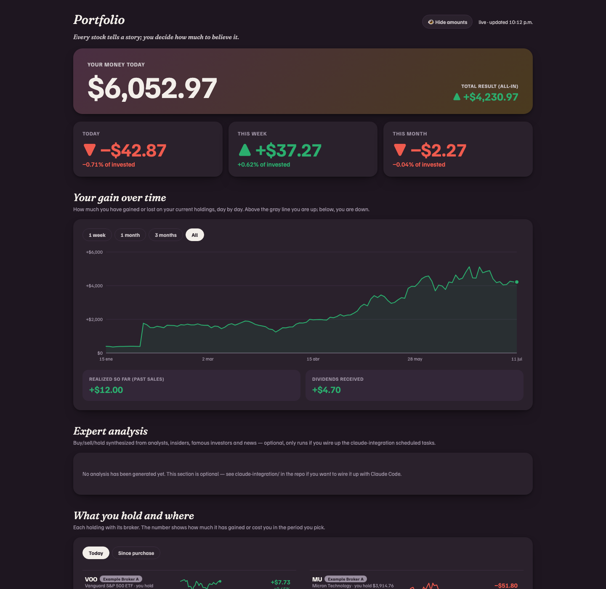
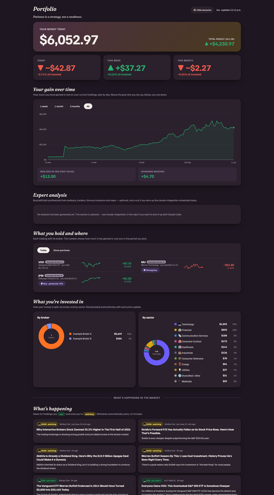

# 📈 Portfolio Tracker

A self-hosted, local-first dashboard for your own brokerage positions — live
prices, gains, and a "smart money" panel, built from free public data. No
account, no cloud, no telemetry.

**🌐 Languages:** [English](#-english) · [Español](#-español)



<details open>
<summary><b>See the full dashboard 🖼️</b></summary>
<br>



</details>

---

## 🇺🇸 English

A self-hosted, local-first dashboard for your own brokerage positions:
live prices, unrealized P&L, day/week/month moves, sector/broker
composition, a watchlist, and a 🕵️ "smart money" panel (SEC EDGAR insider
trades + curated 13F filings for well-known investors) — all from free
public data sources.

No account, no cloud, no telemetry. It runs on `localhost` and reads a JSON
file you control.

### 🚀 Quickstart

```bash
git clone https://github.com/alexadarks/portfolio-tracker.git
cd portfolio-tracker
pip install -r requirements.txt

cp config.example.yaml config.yaml
# edit config.yaml: your local currency 💱, your brokers (or none), watchlist

# Add each holding you own — pick ONE of these:
python3 add_position.py                       # interactive prompts, no AI needed
# OR, if you use Claude Code: ask Claude to read your broker screenshots and
# write them into data/positions.json following the schema in
# data/positions.example.json (copy that file to data/positions.json first)

python3 app.py
# open http://localhost:5057
```

That's it — the dashboard fetches live prices via `yfinance` on each load.

### 🧩 What this is

- `portfolio_lib.py` — reads `data/positions.json` + `config.yaml`, fetches
  live/historical prices via yfinance, computes P&L, builds the JSON snapshot
  the dashboard renders.
- `smart_money.py` — free SEC EDGAR lookups: Form 4 insider buy/sell for your
  own holdings, and 13F quarterly holdings for the investors you list in
  `config.yaml`'s `famous_investors`.
- `app.py` — a small Flask app serving the dashboard and a few JSON
  endpoints (`/api/portfolio`, `/api/insights`, `/api/smart-money`,
  `/api/ticker-search`, `/api/watchlist`).
- `templates/head.html` + `templates/body.html` — the UI (editorial
  cream/serif design, light + dark themes, no build step — plain HTML/CSS/JS).
- `add_position.py` — interactive CLI to add/update a position by hand. This
  is the primary, zero-AI onboarding path.
- `claude-integration/` — **optional** 🤖 example templates for wiring this up
  to Claude Code scheduled tasks (see below). Skip this folder entirely if
  you don't use Claude Code.

### ⚙️ Configuration

Copy `config.example.yaml` to `config.yaml` (gitignored — your real setup
never gets committed) and edit:

- `local_currency` 💱 — an ISO code (`CLP`, `MXN`, `EUR`, `GBP`, ...) for a
  secondary currency conversion next to USD figures. Set to `USD` to disable
  it. If the FX ticker can't be resolved on Yahoo Finance, the dashboard
  quietly falls back to USD-only — it never crashes on this.
- `brokers` 🏦 — define as many as you use, each with a `commission_model` of
  `per_trade`, `aum_annual`, or `none`. Zero brokers is also fine.
- `cash_balances`, `watchlist`, `famous_investors` — all optional, all
  editable at any time.

Positions live in `data/positions.json` (gitignored), a flat JSON array — see
`data/positions.example.json` for the shape:

```json
{
  "ticker": "VOO",
  "name": "Vanguard S&P 500 ETF",
  "broker": "Example Broker A",
  "quantity": 2.5,
  "cost_price": 480.0,
  "entry_date": "2026-01-15",
  "realized_usd": 0.0,
  "dividends_usd": 3.2
}
```

### 🤖 Optional: Claude Code integration

`claude-integration/portfolio-daily-suggestion/` and
`claude-integration/portfolio-price-refresh/` are example scheduled-task
templates for Claude Code users — one shows how you might have Claude
synthesize an expert-style daily read (analysts, insiders, famous-investor
filings, news) on top of the same data this dashboard uses; the other is a
lightweight price-cache warm-up. **Neither is required.** The dashboard is
100% functional without Claude Code, without any LLM, and without internet
access to anything other than Yahoo Finance and SEC EDGAR.

#### ✍️ Setup prompt

If you have [Claude Code](https://claude.com/claude-code) installed, the
easiest way to turn this on is to paste the prompt below into a Claude Code
session opened at the root of your clone. It reads the template, fills in
your real path, wires the small amount of glue code the template
deliberately leaves out (an `/api/expert-analysis` endpoint + a dashboard
card), and schedules the daily run — adjust the cron time/timezone to taste.

```
I want to enable the optional "expert daily read" feature described in
claude-integration/portfolio-daily-suggestion/SKILL.md in this repo
(portfolio-tracker). Please:

1. Read that SKILL.md and claude-integration/portfolio-price-refresh/SKILL.md.
2. Replace every <YOUR_PROJECT_PATH> placeholder with the absolute path to
   this repo on my machine.
3. Add a small /api/expert-analysis endpoint to app.py that reads
   data/expert_analysis.json (tolerating a missing/corrupt file) and a
   matching card in templates/body.html to display market_view + the
   per-ticker action/conviction/reasoning, styled consistently with the
   rest of the dashboard.
4. Set up a recurring scheduled task (ask me what time/timezone and how
   often — I'd like once a day before market open, plus optionally a
   lightweight price-only refresh at midday) that runs the daily-suggestion
   routine and writes data/expert_analysis.json using an atomic write
   (write to .tmp, then rename).
5. Never place real buy/sell orders or fabricate data — this feature is
   informational only, exactly as the SKILL.md says.

Ask me before scheduling anything, and show me the diff before writing to
app.py or templates/body.html.
```

### 🚫 What this does NOT do

- No real brokerage integration (no OAuth/API to Schwab, Fidelity, Fintual,
  etc.) — you enter your own positions.
- No financial advice, no trade execution, no automated buying/selling.
- Data comes only from free public sources: Yahoo Finance (via `yfinance`,
  prices/news/analyst consensus) and SEC EDGAR (insider Form 4, 13F filings).
  Both can be delayed, incomplete, or rate-limited — treat this as a
  convenience view, not a source of truth for tax or accounting purposes.
- No guarantee of uptime, accuracy, or fitness for any particular purpose —
  see [LICENSE](LICENSE).

### 📜 License

[PolyForm Noncommercial 1.0.0](https://polyformproject.org/licenses/noncommercial/1.0.0)
— see [LICENSE](LICENSE).

In short: free to use, study, modify, and self-host for personal,
educational, or otherwise noncommercial purposes. **Commercial use
(selling it, running it as a paid product/SaaS, or any monetized
offering built on this code) is not permitted under this license** —
reach out to the copyright holder if you want to discuss commercial terms.

---

## 🇪🇸 Español

Un dashboard autoalojado y local para tus propias posiciones de inversión:
precios en vivo, ganancia/pérdida no realizada, variación diaria/semanal/
mensual, composición por sector/broker, una lista de seguimiento y un panel
🕵️ de "dinero inteligente" (compras/ventas de insiders vía SEC EDGAR +
holdings 13F seleccionados de inversionistas conocidos) — todo desde fuentes
de datos públicas y gratuitas.

Sin cuenta, sin nube, sin telemetría. Corre en `localhost` y lee un archivo
JSON que tú controlas.

### 🚀 Inicio rápido

```bash
git clone https://github.com/alexadarks/portfolio-tracker.git
cd portfolio-tracker
pip install -r requirements.txt

cp config.example.yaml config.yaml
# edita config.yaml: tu moneda local 💱, tus brokers (o ninguno), watchlist

# Agrega cada posición que tengas — elige UNA de estas opciones:
python3 add_position.py                       # preguntas interactivas, sin IA
# O, si usas Claude Code: pídele a Claude que lea tus pantallazos del broker
# y los escriba en data/positions.json siguiendo el formato de
# data/positions.example.json (copia ese archivo a data/positions.json primero)

python3 app.py
# abre http://localhost:5057
```

Listo — el dashboard obtiene precios en vivo vía `yfinance` en cada carga.

### 🧩 Qué es cada cosa

- `portfolio_lib.py` — lee `data/positions.json` + `config.yaml`, obtiene
  precios en vivo/históricos vía yfinance, calcula P&L, arma el snapshot
  JSON que renderiza el dashboard.
- `smart_money.py` — consultas gratuitas a SEC EDGAR: compras/ventas de
  insiders (Form 4) de tus propias posiciones, y holdings trimestrales 13F
  de los inversionistas que listes en `famous_investors` de `config.yaml`.
- `app.py` — una app Flask pequeña que sirve el dashboard y algunos
  endpoints JSON (`/api/portfolio`, `/api/insights`, `/api/smart-money`,
  `/api/ticker-search`, `/api/watchlist`).
- `templates/head.html` + `templates/body.html` — la interfaz (diseño
  editorial crema/serif, temas claro y oscuro, sin build step — HTML/CSS/JS
  plano).
- `add_position.py` — CLI interactivo para agregar/actualizar una posición a
  mano. Este es el camino principal de onboarding, sin IA.
- `claude-integration/` — plantillas de ejemplo **opcionales** 🤖 para
  conectar esto a tareas programadas de Claude Code (ver abajo). Ignora esta
  carpeta por completo si no usas Claude Code.

### ⚙️ Configuración

Copia `config.example.yaml` a `config.yaml` (ignorado por git — tu
configuración real nunca se sube) y edita:

- `local_currency` 💱 — un código ISO (`CLP`, `MXN`, `EUR`, `GBP`, ...) para
  mostrar una conversión de moneda secundaria junto a las cifras en USD.
  Pon `USD` para desactivarlo. Si el ticker de FX no se puede resolver en
  Yahoo Finance, el dashboard cae de vuelta a solo-USD sin romperse.
- `brokers` 🏦 — define los que uses, cada uno con un `commission_model` de
  `per_trade`, `aum_annual`, o `none`. Cero brokers también funciona.
- `cash_balances`, `watchlist`, `famous_investors` — todos opcionales,
  editables en cualquier momento.

Las posiciones viven en `data/positions.json` (ignorado por git), un arreglo
JSON plano — ver `data/positions.example.json` para el formato:

```json
{
  "ticker": "VOO",
  "name": "Vanguard S&P 500 ETF",
  "broker": "Example Broker A",
  "quantity": 2.5,
  "cost_price": 480.0,
  "entry_date": "2026-01-15",
  "realized_usd": 0.0,
  "dividends_usd": 3.2
}
```

### 🤖 Opcional: integración con Claude Code

`claude-integration/portfolio-daily-suggestion/` y
`claude-integration/portfolio-price-refresh/` son plantillas de ejemplo de
tareas programadas para usuarios de Claude Code — una muestra cómo podrías
hacer que Claude sintetice una lectura diaria estilo "experto" (analistas,
insiders, holdings de inversionistas famosos, noticias) sobre los mismos
datos que usa este dashboard; la otra es un refresco liviano de precios.
**Ninguna es obligatoria.** El dashboard funciona al 100% sin Claude Code,
sin ningún LLM, y sin acceso a internet más allá de Yahoo Finance y SEC
EDGAR.

#### ✍️ Prompt de configuración

Si tienes [Claude Code](https://claude.com/claude-code) instalado, la forma
más fácil de activar esto es pegar el siguiente prompt en una sesión de
Claude Code abierta en la raíz de tu clon del repo. Lee la plantilla, llena
tu ruta real, conecta el pegamento que la plantilla deja afuera a propósito
(un endpoint `/api/expert-analysis` + una tarjeta en el dashboard), y
programa la corrida diaria — ajusta horario/zona horaria a tu gusto.

```
Quiero activar la funcionalidad opcional de "lectura experta diaria"
descrita en claude-integration/portfolio-daily-suggestion/SKILL.md de este
repo (portfolio-tracker). Por favor:

1. Lee ese SKILL.md y claude-integration/portfolio-price-refresh/SKILL.md.
2. Reemplaza cada placeholder <YOUR_PROJECT_PATH> con la ruta absoluta de
   este repo en mi máquina.
3. Agrega un pequeño endpoint /api/expert-analysis a app.py que lea
   data/expert_analysis.json (tolerando un archivo faltante/corrupto) y una
   tarjeta correspondiente en templates/body.html para mostrar market_view +
   la acción/convicción/razonamiento por ticker, con un estilo consistente
   con el resto del dashboard.
4. Configura una tarea programada recurrente (pregúntame el horario/zona
   horaria y con qué frecuencia — quiero una vez al día antes de la apertura
   del mercado, más opcionalmente un refresco liviano de precios al
   mediodía) que corra la rutina diaria y escriba data/expert_analysis.json
   con escritura atómica (escribir a .tmp, luego renombrar).
5. Nunca coloques órdenes de compra/venta reales ni inventes datos — esta
   funcionalidad es solo informativa, tal como dice el SKILL.md.

Pregúntame antes de programar cualquier tarea, y muéstrame el diff antes de
escribir en app.py o templates/body.html.
```

### 🚫 Qué NO hace esto

- No tiene integración real con brokers (sin OAuth/API a Schwab, Fidelity,
  Fintual, etc.) — tú ingresas tus propias posiciones.
- No da asesoría financiera, no ejecuta órdenes, no compra/vende
  automáticamente.
- Los datos vienen solo de fuentes públicas gratuitas: Yahoo Finance (vía
  `yfinance`, precios/noticias/consenso de analistas) y SEC EDGAR (Form 4 de
  insiders, filings 13F). Ambas pueden tener retraso, estar incompletas, o
  tener rate-limiting — trátalo como una vista de conveniencia, no como
  fuente de verdad para efectos tributarios o contables.
- Sin garantía de disponibilidad, exactitud, o idoneidad para ningún
  propósito particular — ver [LICENSE](LICENSE).

### 📜 Licencia

[PolyForm Noncommercial 1.0.0](https://polyformproject.org/licenses/noncommercial/1.0.0)
— ver [LICENSE](LICENSE).

En resumen: libre para usar, estudiar, modificar, y autoalojar con fines
personales, educativos, o no comerciales en general. **El uso comercial
(venderlo, ofrecerlo como producto pago/SaaS, o cualquier oferta
monetizada construida sobre este código) no está permitido bajo esta
licencia** — contacta al titular de los derechos si quieres discutir
términos comerciales.
